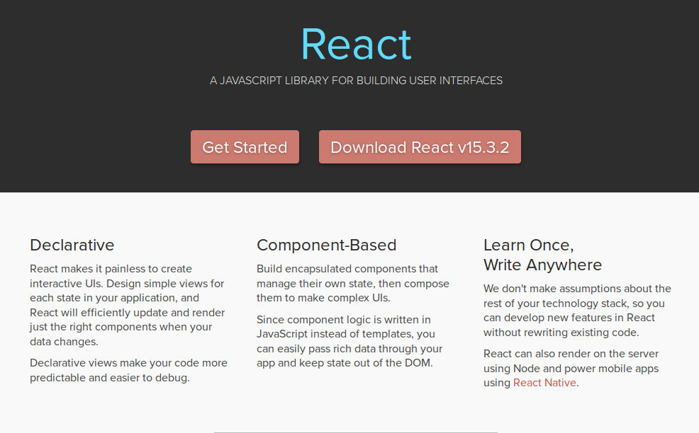

--

# React : From Web to Native and back

[@codeheroics](http://www.twitter.com/codeheroics) - [codeheroics.com](https://www.codeheroics.com)

--

# Oh, hi! I'm Hugo

* Telecom Lille graduate
* Freelance JS developer
* SFR > TF1 > Le Monde > Vente-Privée > Voyages-SNCF

--

### Previously on TakeOff:

* You've heard about ES2016
* You've heard about sharing code between native platforms.

--

### We're gonna talk about React
* An Open-Source "JavaScript library for building user interfaces", pushed by Facebook

--

### Core Philosophies


--

### What this means (to me)

#### A library to build, architecture, create web apps in a way I can understand.

--

### In React, you work with a single concept:

#### The Component

It is re-usable, and has :
* **Props** (the attributes which are given to him)
* An internal **State**
* A **lifecycle** (Creation, update, suppression)

--

### JSX

* HTML-like syntax to describe components rendering
* Optional, but used by most of the community
* Ugly... but practical and easy to read.

```js
class HelloTakeOff extends React.Component {
  render() {
    return (
      <div>Hello TakeOff!</div>
    )
  }
}

ReactDOM.render(<HelloTakeOff />, document.getElementById('root'));
```

--

# Let's write a basic app: a Pokédex.

--

### First, we need a Pokemon component


```js
import React from 'react'

class Pokemon extends React.Component {
  render() {
    return (
      <div>
         <span>{this.props.name}</span>
      </div>
    )
  }
)

```
--

### Let's make Pikachu!

```js
import React from 'react'

const pikachuImage = 'https://codeheroics.github.io/pokemon-sprites/25.png'

class Pikachu extends React.Component {
  render() {
    return (
        <Pokemon name="Pikachu" image={pikachuImage} />
      )
  }
}

```
We give to the `Pokemon` Component its name and image as props

--

### Now let's display multiple Pokémons

```js
import React from 'react'

const pikachuData = { name: "Pikachu", image: pikachuImage }
const pichuData = { name: "Pichu", image: pichuImage}
const pokemons = [pikachuData, pichuDatas]

class Pokemons extends React.Component {
  render() {
    return (
      <div>
        {pokemons.map(pokemon => (
          <Pokemon name={pokemon.name} image={pokemon.image}
        ))}
      </div>
    )
  }
}
```

Using curly braces switches from JSX to a JS context
--

### Finally, let's search & filter

```js

class Search extends React.Component {
  constructor(props) {
    super(props)
    this.state = { searchTerm: '' }
  }

  search = (event) => {
    this.setState({ searchTerm: event.target.value })
  }

  render() {
    const { searchTerm } = this.state
    const { pokemons } = this.props
    const displayedPokemons = (pokemons.filter(({ identifier }) => identifier.includes(searchTerm)))

    return (
      <div className="Search">
          <input type="text" onChange={this.search} />
          <Pokemons pokemons={displayedPokemons} />
      </div>
    )
  }
}
```

--

### We can now build React apps!

#### We know the main concept.

We've covered the "learn once" part of the philosophy

Let's work on the "write anywhere" part

--

### I wish I knew how to write mobile apps

I mean, REAL native apps, not embedded webviews.

--

### Here's what I know about the native world:

* No HTML
* No CSS
* C#, Objective-C or Swift
* Views

--

Views. Which kinda do work like CSS3's flexboxes.

--

### So... If we add some constraints to React...

* no HTML... But equivalents: Views, which are flexbox containers
* no CSS, but elements we can style individually

If we can use JSX, our HTML-like syntax, to compile to something other that HTML...

--

### Then we get React-Native

A way to write native apps for Android, iOS, the Universal Windows Platform, and even Ubuntu.

--

# So. remember our Pokedex?

--

### Here's our Pokemon, ready for React-Native

```js
import React from 'react'
import { View, Text, Image, StyleSheet } from 'react-native'

const styles = StyleSheet.create({
  container: { height: 112, flexDirection: 'column', alignItems: 'center' },
  image: { width: 96, height: 96 }
})


class Pokemon extends React.Component {
  render() {
    return (
      <View style={styles.container}>
        <Image source={this.props.image} /><Text>{this.props.name}</Text>
      </View>
    )
  }
)
```
--

### Here's our Pokemon list, ready for React-Native

```js
import React from 'react'
import { ScrollView } from 'react-native'

const pikachu = { name: "Pikachu", image: pikachuImage }
const pichu = { name: "Pichu", image: pichuImage}
const pokemons = [pikachu, pichu]

class Pokemons extends React.Component {
  render() {
    return (
      <ScrollView>
        {pokemons.map(pokemon => (
          <Pokemon name={pokemon.name} image={pokemon.image}
        ))}
      </ScrollView>
    )
  }
}
```

--

### And finally, our Search Component

```js

class Search extends React.Component {
  constructor(props) {
    super(props)
    this.state = { searchTerm: '' }
  }

  search = (searchTerm) => {
    this.setState({ searchTerm })
  }

  render() {
    const { searchTerm } = this.state
    const { pokemons } = this.props
    const displayedPokemons = (pokemons.filter(({ identifier }) => identifier.includes(searchTerm)))

    return (
      <View>
          <View><TextInput onChangeText={this.search} /></View>
          <Pokemons pokemons={displayedPokemons} />
      </View>
    )
  }
}
```


--

### React-Native

* We've learned once, and we can write everywhere!
* Now remember, the philosophy here is "learn once, write everywhere", NOT "write once, everywhere"
* To follow OS patterns, you can split code between versions

```js
return Platform.OS === 'ios' ? <PickerIOS /> : <Picker />
```

--

### By the way

Our React-Native code looks a lot like our React code
With just an extra set of constraints
So we could just apply these constraints to webapps too, right?

--

### React-Native-Web

* An exciting project, with some interesting use cases
* Down the road, may be the way to "write once, everywhere"

--

### Testing

#### Jest & snapshot testing

* Testing components sucks. They change all the time.
* Snapshot testing is an elegant solution to that.

--

### Visual Testing

#### React-Storybook

* Automatic testing is cool...
* But automatic testing won't tell me if my component looks terrible

--

### I probably don't have time to talk about this

But check out
* React-Music
* React-Game-Kit

for some great experiments of what is being done with React!

--

### What I don't like about React

* JSX is ugly, and the community is fine with it. There are alternatives, but it still feels like the best solution.
```js
<div>
  {/* This is a comment in JSX and I hate it */}
</div>
```
* Is it functional? Is it Object-Oriented? Is it stuck between the two forever?
* The JS Fatigue Phenomenon (far from exclusive to React, but still)

--

### JS Fatigue

React is simple, but small, so its ecosystem is huge and made of small pieces.

**Webpack** *Flux* **Redux** *MobX* **Storybook** *Jest* **Sagas** *React-Router* **npm** *ES2015*+...

It makes me kinda sad to think developers are tired, when we've never solved problems so well.


--

### We have not "solved" front-end development.

But we're doing our very best to find a good, easy to reason about solution.

--

# For now, React is the best solution I have.

--

# Thanks.

```js
<Speaker
  name="Hugo Agbonon"
  twitter="@codeheroics"
  website="https://www.codeheroics.com"
  freelance
  isReadyToAnswerQuestions
/>
```
